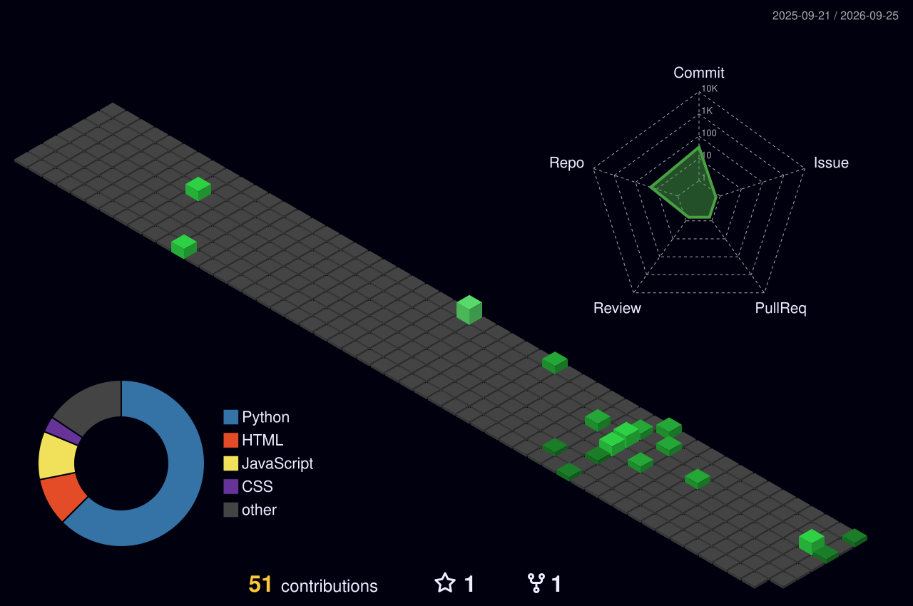

<!-- ══════════════════════════════════════════════════════════════════
     MOHAMMED BILAL NADEEM · GitHub Profile
     palette: #05010A  #39FF14  #00E5FF  #B026FF  #FF2E97
     ══════════════════════════════════════════════════════════════════ -->

<div align="center">


<a href="https://github.com/MdBilalNad">
  
</a>

<br/>


</div>

<br/>


<br/>

---

## `> whoami`

```console
$ whoami
Mohammed Bilal Nadeem ── AI/ML Engineer

$ cat role.txt
Aspiring AI/ML Engineer with strong foundations in Python, machine
learning pipelines, and model deployment.

$ pwd
Lucknow, India

$ cat status.log
[ OK ]  B.Tech CSE (Artificial Intelligence & Cloud Computing)
        Integral University ── Jul 2024 → Jul 2028 ── CGPA 7.9
[ OK ]  Data Science Intern @ Sipher Web Pvt Ltd
        May 2026 → Aug 2026
[ RUN ] Shipping ML pipelines, dashboards and tools that people actually use
```

---

## `> stack --list`

<div align="center">

**LANGUAGES & DATA**


**ML / DL FRAMEWORKS**


**BACKEND & TOOLS**


**PLATFORMS**


</div>

<div align="center">

| DOMAIN | TOOLING |
|:---|:---|
| **Data Analysis** | Pandas · NumPy · Matplotlib · Plotly · Power BI |
| **Machine Learning** | Scikit-learn · Regression · Recommendation Systems · Model Evaluation |
| **AI & Deployment** | PyTorch · TensorFlow · Streamlit · Flask · FastAPI · Docker · Kubernetes |
| **Databases** | MySQL · Firebase |

</div>

---

## `> ls ./projects --featured`

<div align="center">

### `CRM-DASHBOARD`

**Interactive CRM dashboard over 45,000+ blood donor records**

Real-time visibility into donor demographics, blood-stock inventory and campaign
performance. Built to drive data-backed decisions on donor outreach and inventory.


<a href="https://github.com/MdBilalNad/CRM-Dashboard">
  
</a>

<br/><br/>

### `RESUME-ANALYZER`

**ATS-style resume scoring engine**

Flask web app that compares resumes against job descriptions using TF-IDF
vectorization and cosine similarity. Extracts resume data with PyMuPDF and scores
20+ skill keywords with improvement suggestions.


<a href="https://github.com/MdBilalNad/Resume-Analyzer">
  
</a>

<br/><br/>

### `STOCK-PREDICTION-PIPELINE`

**End-to-end ML pipeline · 31% error reduction**

Processed 5 years of real-time market data (10,000+ daily records) with 87%
forecasting accuracy. Improved Linear Regression R² from 0.62 → 0.81.


<a href="https://github.com/MdBilalNad/Stock-Prediction-Pipeline">
  
</a>

</div>

---

## `> git log --stat`

<div align="center">


<br/>


<br/><br/>


<br/>


</div>

---

## `> render --contributions --3d`

<div align="center">



</div>

---

## `> ./snake.sh`

<div align="center">

<picture>
  <source media="(prefers-color-scheme: dark)" srcset="https://raw.githubusercontent.com/MdBilalNad/MdBilalNad/output/snake.svg"/>
  <source media="(prefers-color-scheme: light)" srcset="https://raw.githubusercontent.com/MdBilalNad/MdBilalNad/output/snake.svg"/>
  
</picture>

</div>

---

## `> cat education.log certifications.log`

```console
$ cat education.log
Integral University ── Lucknow, India
B.Tech, Computer Science & Engineering          Jul 2024 → Jul 2028
Specialization: Artificial Intelligence & Cloud Computing
CGPA: 7.9

$ cat certifications.log
[✓] Technology Job Simulation .................... Deloitte Australia
[✓] Data Visualization with Cognos Dashboard ..... IBM
[✓] Machine Learning with Python ................. IBM
[✓] Data Visualization ........................... Tata Group
[✓] Cloud Application Developer .................. IBM
```

---

## `> ping me`

<div align="center">

<a href="mailto:mdiblalnad117@gmail.com">
  
</a>
<a href="https://linkedin.com/in/bilalnadeem123/">
  
</a>
<a href="https://github.com/MdBilalNad">
  
</a>

<br/><br/>

```console
$ echo "Always building. Always learning."
Always building. Always learning.
$ █
```

</div>

